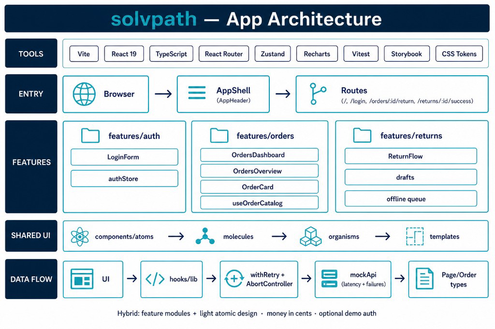
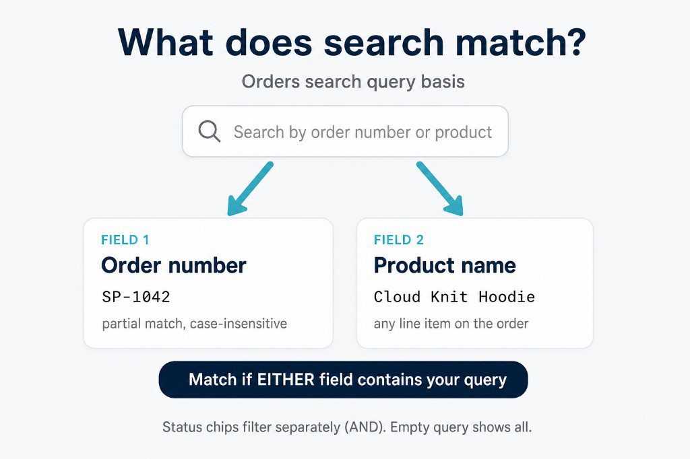
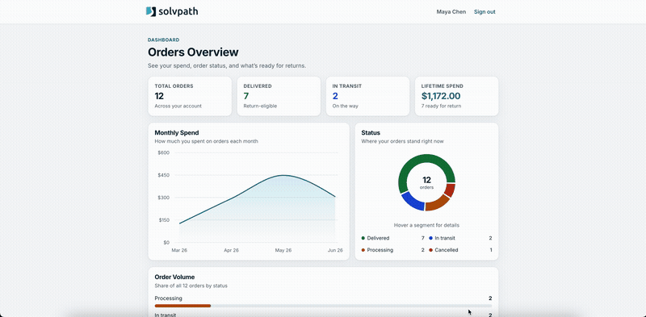

# solvpath

Senior front-end take-home. Browse orders and complete a guided return or exchange.

**Stack:** React 19, TypeScript, Vite, React Router, Zustand, Recharts, Vitest, Storybook, CSS tokens

## Run

```bash
npm install
npm run dev
```

Also useful:

```bash
npm run build
npm test
npm run lint
npm run format
npm run storybook
```

Demo sign-in (optional): `/login`  
`maya.chen@example.com` or `jordan.lee@example.com`

## Features

- Orders overview with search, status filters, and pagination
- Return / exchange flow for delivered orders (refund, exchange, store credit +10%)
- Draft persistence and offline return queue
- Resilient API client (retries around the flaky mock API)
- Storybook for shared UI

## Code style

- ❤️ **ESLint**: `npm run lint` (fix with `npm run lint:fix`)
- ❤️ **Prettier**: `npm run format` (check with `npm run format:check`)

## Architecture



Feature modules (`auth`, `orders`, `returns`) plus light atomic UI (`atoms` → `molecules` → `organisms` → `templates`).

```text
src/
├── api/mockApi.ts
├── components/
├── features/
├── pages/
└── styles/
```

## Search



Orders search runs client-side on the loaded catalog (`filterAndPaginateOrders`), matching the mock API rules:

1. `SearchField` updates `queryInput`
2. `useDebouncedValue` trims and waits 300ms after typing stops before filtering
3. An order is kept when the query is empty, or when **order number** or **any product name** contains the query (case-insensitive)
4. `StatusChips` apply as an AND filter; results are then paginated

## Mobile view


## Desktop view



## Notes for reviewers

- Mock API contract is unchanged (`src/api/mockApi.ts`)
- Returns are only available on **delivered** orders
- Money is handled in integer cents
